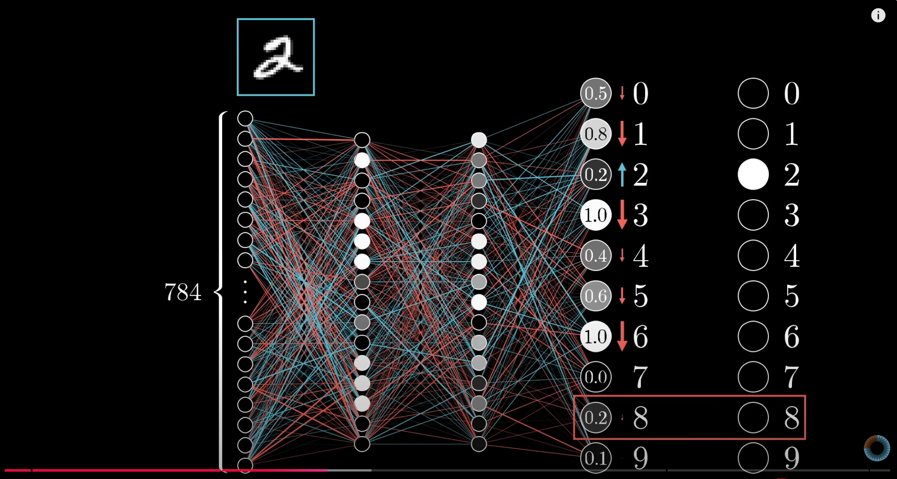
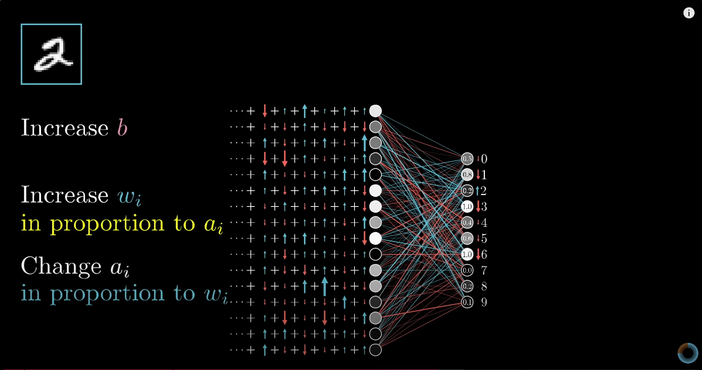

# Goals
- Follow
     - [But what is a neuron network? | Chapter 1, Deep learning](https://www.youtube.com/watch?v=aircAruvnKk&t=147s)
     - [Gradient descent, how neural networks learn | Chapter 2, Deep learning](https://www.youtube.com/watch?v=IHZwWFHWa-w)
     - [What is backpropagation really doing? | Chapter 3, Deep learning](https://www.youtube.com/watch?v=Ilg3gGewQ5U)
     - [Backpropagation calculus | Chapter 4, Deep learning](https://www.youtube.com/watch?v=tIeHLnjs5U8&t=114s)
- Copilot was used to help with completion
- Only 1 dep PIL - for parsing/displaying image

# Usage
- To predict on test set
~~~
py -3 mnist.py -i model.pkl
~~~

- To train 

~~~
py -3 mnist.py -t [optional_starting_model]
~~~

# TODO
- Add visualization of the layer

# Notes
- Download mnist dataset from https://www.kaggle.com/datasets/hojjatk/mnist-dataset?resource=download
- Figureout the dataset format
- Write a dataset loader.
- A neuron takes in multiple inputs and produce a single output - activation
- Each neuron from one layer is connected to all neurons from a previous layer
- output = sigmoid(w*a+b)
    - `a` activation from previous layer
    - `w` weights of the connection between neurons
    - `b` is the bias of this neuron

- The sigmoid function is only there to normalize the output
- Sigmoid(0) == 0.5 so if we initialize the weights and biases to 0, the output of the neuron will be 0.5
- Our model will have 4 layers 784 - 16 - 16 - 10
- The first layer is the input layer 784 == 28*28
- Last layer is the output layer for 10 digits.
- Neuron from one layer will connect to all neuron from its previous layer so we will have:
    - 784*16 + 16*16 + 16*10 = 12960 weights
    - 16 + 16 + 10 = 42 biases

    

- How to feed forward 

    

- The number of weights between 2 layers of size and `m` and `n` will `m*n`
- The number of biases of layer of size `m` wil be m
- The activations of a layer will be the input of the next layer

- Back propagation

    

    

    

- Learning rate of `0.1` is considered too high but It seems to work for me ?

# Pit Falls
- Input need to be normalized 
- Remember to reset the `activations` in feed forward
~~~python
# This is RIGHT
self.biases = [random.random() for i in range(self.dim)]

# This is WRONG
self.biases = [random()]*self.dim
~~~
- Becareful with the sign of `gradient`
- Fucking `sigmoid` function returns 1 from `30` or something making `activations` in the 1st hidden layer becomes all 1
- My model finally converges
- It turns out how we initialize normalizing `input`, intializing `weights` and `biases` and choosing `activation function` is really important.
- The `sigmoid` function resolution is really shitty `sigmoid(40)` is already 1
- It's really important to get the math right in `back_propagation_neuron` right in order for your model to converge.
- Try to invent something with your basic intuition wouldn't work
